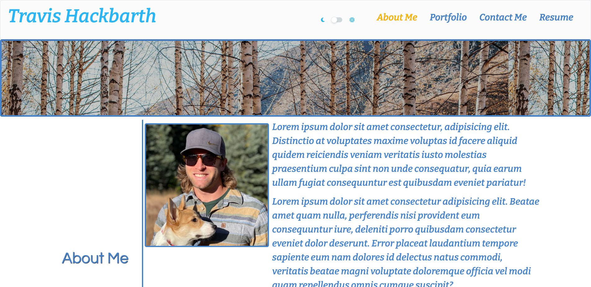

# My Portfolio

## Description

My portfolio, using ReactJS, displays a bit about myself, my past projects, my skills, and a way to contact me.

1. On initial page load, users can select options in the header for About Me, Portfolio, Contact Me, and Resume.

2. About me gives a brief description of myself and an image.

3. The portfolio page will allow users to view past projects and click on them to view each one.

4. The Contact Me page offers users the ability to send me an email and message in order to get in touch using EmailJS.

5. The resume page displays the various skills I have learned in and an option to download my resume.

6. In the Nav Bar, users can switch between light and dark mode for the website.

7. The site is also mobile responsive.

You can visit the deployed website [here](https://travish-bot.github.io/My-Portfolio/)



## Installation

To install necessary dependencies, run the following command:

```
npm i
```

## Questions

If you have any questions about the repo, open an issue or contact me directly at travishackbarth@gmail.com. You can find more of my work at TravisH-bot (https://github.com/TravisH-bot).
